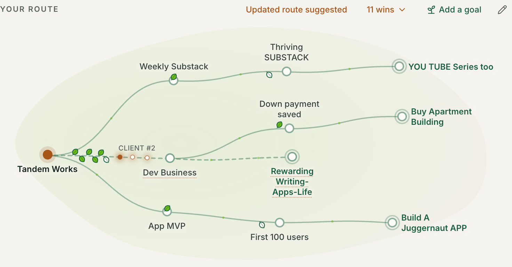

# PATHWAYS

**A Washington career navigator that helps people earn more and move up, starting now.**
Every wage, fee, and deadline it gives comes from a verified Washington source, shown with that source's name and date.

**Live site:** [pathways.click](https://www.pathways.click) · **Access:** email petrafranklin@gmail.com for an access code



---

## Who it's for

People building, changing, or rebuilding their working lives in Washington, including:

- High school seniors who want a good-paying path without heavy debt
- Parents returning to work after time at home
- People coming home from incarceration
- Professionals trained in another country, such as doctors and nurses
- Anyone weighing a new trade, a credential, or their own business

## What makes it different

- **It answers from official Washington data.** Apprenticeships and wages come from the Department of Labor & Industries (L&I) and the Employment Security Department (ESD), not from what an AI happens to remember.
- **It never invents a number.** If no verified source has a figure, PATHWAYS says what to confirm and who to ask, instead of guessing.
- **The person decides.** PATHWAYS suggests routes, next steps, and wins, and nothing is saved to their plan until they confirm it.
- **Your Route grows with them.** The main route runs from where they are to their main goal. Other goals they pursue at the same time branch off it. Wins show up as leaves, and open next steps as small points of light.
- **It can talk.** People can speak their questions and hear a short reply. Audio is never stored, only the transcript.

In blind tests on realistic Washington questions, two judges from different AI companies graded the answers without knowing which system wrote which. PATHWAYS met **90%** of each question's checklist. Claude met 67%, ChatGPT 59%, and Gemini 57%.

## The project

Built for **Campus Evolve** by **Tandem Works**.
Contact: **petrafranklin@gmail.com** for an access code.

---

## How it works

### Where the data comes from

| Data | Source | Refreshed |
|---|---|---|
| Registered apprenticeships, with starting and journey-level wages | L&I Apprenticeship Registration and Tracking System (ARTS), via data.wa.gov | Weekly |
| Wages by occupation and area | ESD Occupational Employment and Wage Estimates | Checked monthly |
| Stepping-stone programs and support services (pre-apprenticeships, ID help, legal help, staffing agencies, teen work rules) | L&I lists, plus records reviewed by a person before they load | Monthly |
| Washington places | U.S. Census | Yearly |
| Anything else | A live lookup limited to an approved list of official sites (state agencies, the Legislature, colleges) | Every question |

Refreshes run on a schedule, and each run is logged. The [health page](https://www.pathways.click/api/health) shows when each source last updated.

### How answers stay honest

1. **Two tiers of knowledge.** Specific figures (wages, fees, hours, deadlines, contacts) must come from a verified source and carry a citation. General structure (how a career ladder is ordered, which agency governs a license) can be stated plainly.
2. **Quotes are checked word for word.** A quote from a live lookup is used only if it appears on the actual source page.
3. **A check after every answer** flags any figure that has no source behind it.
4. **The AI never writes to the database directly.** Every change it proposes goes through a validation layer that enforces what's allowed.

### Privacy in brief

- No real names or email addresses are required. People sign in with an access code.
- Access codes are stored only as one-way hashes, and sessions use signed cookies.
- Voice recordings are never stored.
- Only the PATHWAYS server can read the database; it isn't reachable from the browser.

---

## For developers

### Tech stack

- **App:** Next.js (App Router), React, TypeScript, Tailwind CSS
- **Database:** Supabase (PostgreSQL)
- **AI:** models through [OpenRouter](https://openrouter.ai), configured by environment variable, each with a backup model; OpenAI for voice
- **Hosting:** Vercel, including scheduled data refreshes (Vercel Cron)

### Run it locally

You need Node.js 20 or newer, a Supabase project, and an OpenRouter API key.

```bash
git clone https://github.com/franklinpetra/PATHWAYS.git
cd PATHWAYS
npm install
cp .env.example .env.local   # then fill in each value
```

1. Apply the SQL files in `supabase/migrations/` to your database, in filename order. You can paste each into the Supabase SQL editor or use the Supabase CLI.
2. Load Washington data with `npm run sync -- all` (apprenticeships, wages, places, and reviewed stepping stones). Occupation and training-program exports load with `npm run seed:wa`; the header of `scripts/seed-washington.ts` lists its options.
3. Create an account with `npm run create-user -- --username yourname`. It prints an access code once.
4. Start the app with `npm run dev`, then open http://localhost:3000.

> This project uses a recent Next.js with breaking changes from older versions. Check the guides in `node_modules/next/dist/docs/` before changing framework code.

### Useful commands

| Command | What it does |
|---|---|
| `npm run dev` | Starts the app locally |
| `npm test` | Runs the test suite |
| `npm run typecheck` | Checks TypeScript types |
| `npm run sync -- apprenticeships\|wages\|places\|stepping_stones\|all` | Refreshes Washington data by hand (add `--dry-run` to preview) |
| `npm run eval [-- --case <id>]` | Runs the blind comparison against other AI assistants (costs a few dollars per full run) |
| `npm run create-user -- --username <name>` | Creates an account and prints its access code |
| `npm run reset-user -- --username <name> --yes` | Clears one account's conversations, plan, and wins for testing |

### Where things live

| Path | What's there |
|---|---|
| `lib/agents/orchestrator.ts` | Runs each conversation turn: retrieval, reply, then routes, next steps, and wins |
| `lib/agents/retrieval.ts` | The Fact-Finder: gathers verified Washington sources for each question |
| `lib/agents/prompt.ts` | The system prompt and its directives (kept in sync with `tests/prompt.test.ts`) |
| `lib/agents/grounding.ts` | Checks replies for figures that have no source |
| `lib/validation/state-guard.ts` | The rules for every allowed change to a person's data |
| `lib/db/mutations.ts` | The only code that writes validated changes to the database |
| `components/route/` | Your Route and its map (branches, leaves, points of light) |
| `components/chat/` | The conversation, answer formatting, and voice |
| `app/api/cron/sync/[source]` | The scheduled data refreshes |
| `data/stepping-stones/` | Reviewed program and support-service records |
| `evals/cases.ts` | Test questions and the checklist each answer is graded against |
| `supabase/migrations/` | The database schema |

### Ground rules for contributors

- **The person decides.** The AI organizes, compares, drafts, and suggests. Anything it infers stays unconfirmed until the person confirms it.
- **Never fabricate.** No invented deadlines, eligibility rules, wages, or openings. Every specific claim needs a source and a date.
- **Change data only through the state guard.** Model output never touches the database directly.
- **Reviewed records only.** A curated record loads only after a person has reviewed it (`"status": "reviewed"`).
- **Person-first language.** The user is a person, not a "student" or a "case." Avoid deficit-based or juvenile wording.
- **Keep it calm.** Mobile-first and sparse. No gamified progress bars.
- **Never commit secrets.** Keys live in `.env.local` locally and in Vercel's environment settings in production.

### Reporting a problem

Open an issue on this repository, or email petrafranklin@gmail.com.

## License

No license has been chosen yet. Until one is added, all rights are reserved.
